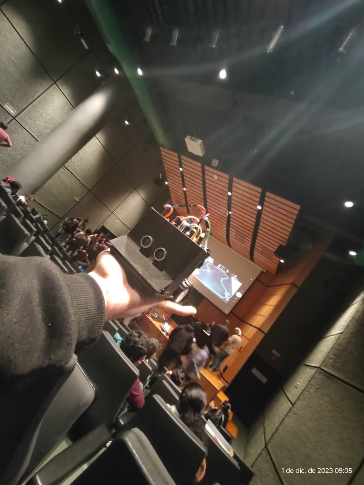
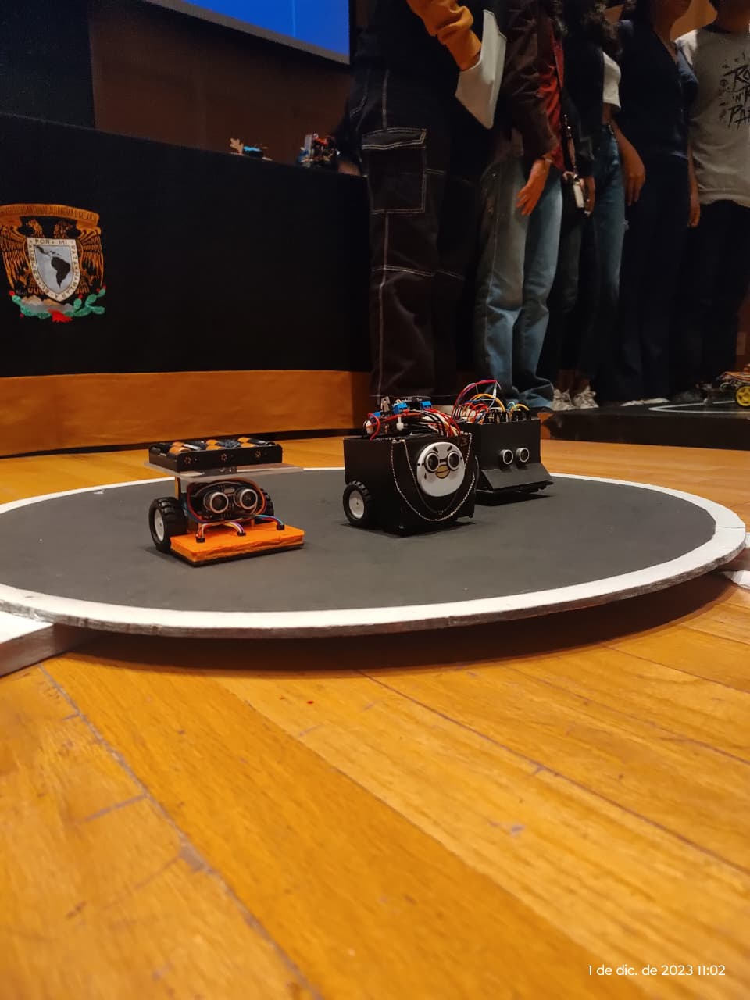

# Robot Sumo Autónomo con Arduino

Robot móvil autónomo diseñado para competencias de sumo robótico. El sistema detecta oponentes mediante sensor ultrasónico y evita salir del dohyo utilizando sensores infrarrojos de línea, ejecutando decisiones de movimiento en tiempo real mediante control diferencial de motores.

Proyecto desarrollado para el XV Concurso de Robótica en la Facultad de Ciencias, UNAM.

El sistema implementa un esquema reactivo basado en sensores donde el microcontrolador procesa información de distancia y detección de borde para tomar decisiones de movimiento.

  
  
   
  <em>Figura: Robot Sumo</em>

## Funcionalidad del sistema

El robot opera bajo dos principios:

- Detección de oponente:

Un sensor ultrasónico mide la distancia frontal. Si detecta un objeto dentro del rango definido, el robot avanza para empujar.

- Detección de borde del dohyo:

Tres sensores infrarrojos detectan la línea blanca del borde. Si se detecta el límite, el robot retrocede para evitar salir del área de combate.

## Estrategia de control

El comportamiento se basa en lógica condicional:

- Oponente detectado + dentro de pista → avanzar

- Borde detectado → retroceder

- Sin oponente → rotación de búsqueda

- Condición de seguridad → detener motores

El control de locomoción se implementa mediante tracción diferencial de dos motores DC.

## Hardware utilizado

- Arduino

- Sensor ultrasónico HC-SR04

- Sensores infrarrojos de línea (x3)

- Driver de motores

- Motores DC

- Chasis robot sumo

Robot funcional diseñado para competencia de sumo robótico, con detección autónoma de oponente y control de permanencia en el dohyo.

## Consideraciones de diseño y ajuste de parámetros

El desempeño del robot depende de la calibración de umbrales de detección y de la estrategia de movimiento. El valor umbral de los sensores infrarrojos determina la sensibilidad a la línea blanca del dohyo y puede requerir ajuste según condiciones de iluminación y reflectividad de la superficie. Asimismo, el rango de detección del sensor ultrasónico define la distancia de activación del comportamiento de ataque.

La velocidad de los motores y los tiempos de retroceso influyen directamente en la estabilidad y capacidad de permanencia dentro del área de combate. El sistema está diseñado bajo un enfoque reactivo de baja latencia, donde las decisiones se ejecutan en tiempo real sin planificación global del entorno.

